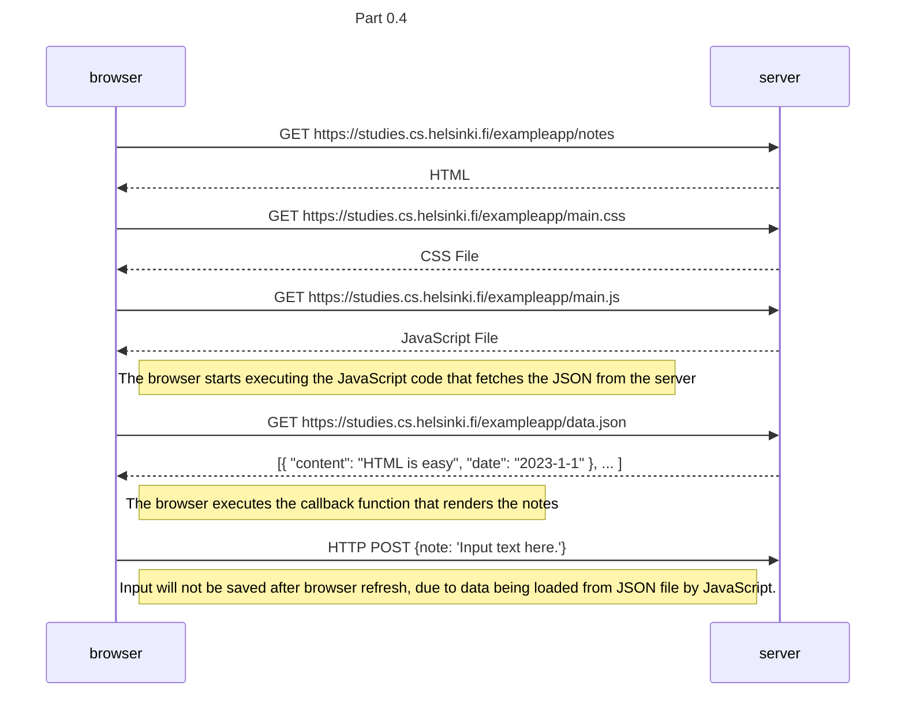

```mermaid
sequenceDiagram
    Title: Part 0.4

    browser->>server: GET https://studies.cs.helsinki.fi/exampleapp/notes
    server-->>browser: HTML

    browser->>server: GET https://studies.cs.helsinki.fi/exampleapp/main.css
    server-->>browser: CSS File
   
    browser->>server: GET https://studies.cs.helsinki.fi/exampleapp/main.js
    server-->>browser: JavaScript File

    Note right of browser: The browser starts executing the JavaScript code that fetches the JSON from the server

    browser->>server: GET https://studies.cs.helsinki.fi/exampleapp/data.json
    server-->>browser: [{ "content": "HTML is easy", "date": "2023-1-1" }, ... ]
   
    Note right of browser: The browser executes the callback function that renders the notes

    browser->>server: HTTP POST {note: 'Input text here.'}

    Note right of browser: Input will not be saved after browser refresh, due to data being loaded from JSON file by JavaScript.
```